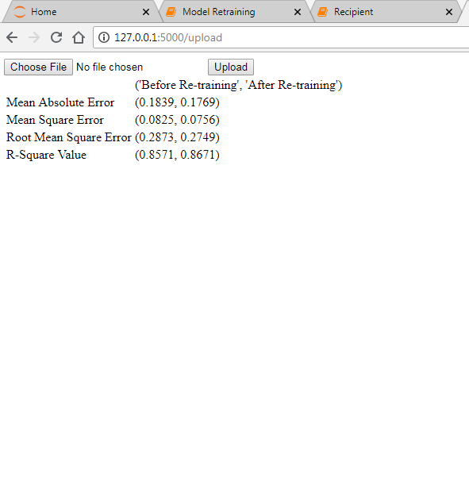

# Model_Offline_Retraining_HousePrice
1. Download main dataset (i.e. 'DC_Properties.csv') from here: https://www.kaggle.com/christophercorrea/dc-residential-properties#DC_Properties.csv

2. Run IPython Notebook 'Model Retraining'. It will train the model, export it(pickle file) and create 3 .csv files 'new.csv' and 'old.csv' and 'test_data.csv'.

3. Install Flask package (if not already installed) and go to http://127.0.0.1:5000/upload.

4. Upload the 'new.csv'(You can also upload new data with matching columns) file and click on upload button. Output will be displayed as shows in the screenshot here:

